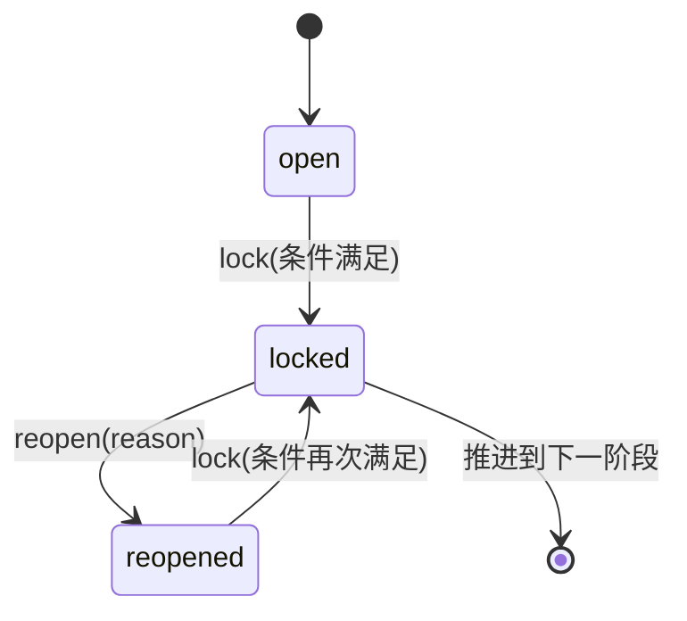

# 08 · HITL + 导出引擎 v2.0

## 1. Gate 状态机

3 个 Gate 串联在阶段流转上：

- **G1 = PRD 锁定**（requirement → design）
- **G2 = 设计 5 子产物全部锁定**（design → dev）
- **G3 = 审查通过 / P0 清零**（dev → review-done）



### 1.1 实现 `src/lib/hitl/gates.ts`

（代码同 v1.0 §08 §1，本页不重复；只记三个关键点）。

- `checkConditions(projectId, gate)`：返回 `{ ok, reasons[] }`。
- `lockGate(projectId, gate)`：不满足抛 `AppError('E_GATE_CLOSED', { reasons })`；成功后 `Project.currentStage` 推进。
- `reopenGate(projectId, gate, reason)`：状态回退，`Artifact.locked = false`（仅本阶段产物）。

### 1.2 v2.0 新增：锁定 / 驳回后推送 GateCard

```tsx
// src/lib/hitl/notify.ts
export function broadcastGateCard(projectId: string, msg: { kind:'gate-card', ... }) {
  // 调 src/lib/ws/bus.ts 的 broadcast(projectId, msg)，让所有订阅该项目的 WS 连接都在聊天流里插入审批卡。
}
```

## 2. 三档 HITL 模式

项目级配置 `Project.hitlMode`：`manual` / `auto` / `hybrid`。Orchestrator 在每个 Job 结束后调 `maybeAdvance(projectId, gate)`：

```tsx
import { lockGate } from '@/lib/hitl/gates'
import { confidenceFor } from '@/agents/confidence'
import { broadcastGateCard } from '@/lib/hitl/notify'

export async function maybeAdvance(projectId: string, gate: GateType) {
	const project = await prisma.project.findUniqueOrThrow({ where: { id: projectId } })
	if (project.hitlMode === 'manual') {
		broadcastGateCard(projectId, { kind:'gate-card', gate, status:'open', reasons: (await checkConditions(projectId, gate)).reasons })
		return
	}
	if (project.hitlMode === 'auto') {
		try { const r = await lockGate(projectId, gate); broadcastGateCard(projectId, { kind:'gate-card', gate, status:'locked' }) } catch {}
		return
	}
	// hybrid：自评分 ≥ 阈值才推
	const score = await confidenceFor(projectId, gate)
	await prisma.gate.update({ where: { projectId_type: { projectId, type: gate } }, data: { confidence: score, mode: 'hybrid' } })
	if (score >= project.hitlThreshold) {
		try { await lockGate(projectId, gate); broadcastGateCard(projectId, { kind:'gate-card', gate, status:'locked', confidence: score }); return } catch {}
	}
	broadcastGateCard(projectId, { kind:'gate-card', gate, status:'open', confidence: score })
}
```

### 2.1 自评分 `src/agents/confidence.ts`

用 Gateway 跑一次评分调用，system prompt：

```jsx
你是评审员。给定刚生成的产物（PRD / 设计集 / 审查报告），输出 0-1 之间的浮点 confidence。
标准：完整性、内部一致性、是否覆盖 PRD 全部 AC。
仅输出 JSON：{"score": number, "reasons": string[]}.
```

如果调用本身失败 → 返回 0.5，混合模式相当于退化为「需要人工」。

## 3. v2.0 新增：Gate 审批卡片插入聊天流

- 后端 `broadcastGateCard` 推 `{ kind:'gate-card', gate, status, reasons?, confidence? }` 到 WS。
- 前端「聊天窗口 reducer」（§05 §5）记录为一条 message，由 `<GateCard />` 渲染：
    - `status='open'`：按钮「锁定」（点击发 `{ kind:'gate-decision', gate, decision:'lock' }`）与「驳回」。
    - `status='locked'`：绿底，展示 confidence；依然可「驳回」。
    - `status='reopened'`：橙底，展示 reopenReason。
- 这使得审批交互与聊天主流同一画面，用户不需跳另一个面板。

## 4. 导出引擎总览

4 类制品 + 1 类聊天日志（v2.0 新增）× 5 种格式。同步流程，pandoc 任务限 60s 超时，结果落 `./storage/exports/{projectId}/`。

| 制品 | md | docx | pdf | xlsx | zip |
| --- | --- | --- | --- | --- | --- |
| PRD | ✅ 复制 | ✅ pandoc | ✅ pandoc+xelatex | — | — |
| 设计集 | ✅ 合并 | ✅ pandoc | ✅ pandoc+xelatex | — | — |
| 代码 | — | — | — | — | ✅ git-zip |
| 审查报告 | ✅ | ✅ | ✅ | ✅ 缺陷表 | — |
| **聊天日志**（v2.0） | ✅ messages + thinking + tool-call | ✅ pandoc | — | — | — |

## 5. pandoc / excel / git-zip

- `src/lib/export/pandoc.ts`：`pandocConvert({ inputMd, outputPath, format: 'docx' | 'pdf' })`，pdf 加 `--pdf-engine=xelatex -V mainfont="Noto Sans CJK SC"`，60s 超时。
- `src/lib/export/excel.ts`：exceljs 生成缺陷表（从 [review-report.md](http://review-report.md) 按正则抽 `^- \[(P0|P1|P2)\] (.+)$`）。
- `src/lib/export/git-zip.ts`：simple-git 初始化 + `git archive --format=zip`；git archive 不可用时 fallback `tar -czf`。

代码同 v1.0 §08，本页不重复。

## 6. v2.0 新增：聊天日志导出

```tsx
// src/lib/export/chat-log.ts
export async function exportChatLog(projectId: string, agentType: string, format: 'md' | 'docx') {
	const conv = await prisma.conversation.findUniqueOrThrow({ where: { projectId_agentType: { projectId, agentType } } })
	const messages = await prisma.message.findMany({ where: { conversationId: conv.id }, orderBy: { createdAt: 'asc' } })
	const lines: string[] = [`# 会话日志：${agentType}`, '']
	for (const m of messages) {
		switch (m.kind) {
			case 'user':       lines.push(`## 👤 用户`, '', m.content, ''); break
			case 'assistant':  lines.push(`## 🤖 Agent`, '', m.content, ''); break
			case 'thinking':   lines.push(`> 💭 **思考**`, '> ' + m.content.replace(/\n/g, '\n> '), ''); break
			case 'tool': {
				const t = JSON.parse(m.content)
				lines.push(`<details><summary>🔧 ${t.name} ${t.ok ? '✅' : '❌'}</summary>`, '', '```json', JSON.stringify(t, null, 2), '```', '</details>', '')
				break
			}
			case 'artifact': { const a = JSON.parse(m.content); lines.push(`> 📦 已生成 **${a.kind}** v${a.version}（${a.sizeBytes} bytes）`, ''); break }
		}
	}
	const md = lines.join('\n')
	const outDir = paths.exports(projectId)
	const mdPath = path.join(outDir, `chat-${agentType}.md`); await fs.writeFile(mdPath, md, 'utf8')
	if (format === 'md') return mdPath
	const docxPath = path.join(outDir, `chat-${agentType}.docx`)
	return pandocConvert({ inputMd: mdPath, outputPath: docxPath, format: 'docx' })
}
```

## 7. 导出 Route Handler 骨架

```tsx
// src/app/api/projects/[id]/exports/[type]/route.ts
export const POST = withErrorBoundary(async (req: Request, { params }: any) => {
	const body = await req.json()
	const formats: string[] = body.formats ?? []
	const outDir = paths.exports(params.id)
	await fs.mkdir(outDir, { recursive: true })
	const files: Array<{ format: string; downloadUrl: string; error?: string }> = []
	for (const f of formats) {
		try {
			const p = await runExport(params.id, params.type, f, outDir)
			files.push({ format: f, downloadUrl: `/api/projects/${params.id}/exports/${path.basename(p)}/download` })
		} catch (e: any) {
			files.push({ format: f, downloadUrl: '', error: String(e?.message ?? e) })
		}
	}
	return { files }
})
```

`runExport(projectId, type, format, outDir)` 路由到应用函数：prd / design / code / review 按 v1.0 逻辑；chat-log 按 §6。

## 8. 可降级清单

- pandoc 不在 PATH：所有 docx/pdf 改返 `error:'pandoc 未安装'`，前端展示「仅 markdown 可用」。
- xelatex 中文字体未装：PDF 失败可以，docx 仍能给。
- 混合模式自评分超时：默认 0.5（退化为人工）。
- exceljs 失败：仅返回 markdown 版审查表。
- git archive 不可用：fallback `tar -czf`。
- 聊天日志导出只支持 md。

## 9. v2.0 → Fix-Pack #4 J5 同步

<aside>
🧷

本节回填 [全栈智码 v2.0 · Fix-Pack #4（设计 UI + 开发阶段 + 沙箱替代 for Claude Code）](%E5%85%A8%E6%A0%88%E6%99%BA%E7%A0%81%20v2%200%20%C2%B7%20Fix-Pack%20#4%EF%BC%88%E8%AE%BE%E8%AE%A1%20UI%20+%20%E5%BC%80%E5%8F%91%E9%98%B6%E6%AE%B5%20+%20%E6%B2%99%E7%AE%B1%E6%9B%BF%E4%BB%A3%20for%20Cl%203e7bd8639ec44063aec90d24fa4c1930.md) 的 G3 改造，覆盖 §1.1 / §1.2 / §3。如本节与上文冲突，**以本节为准**。

</aside>

### 9.1 G3 锁定改造：原子「锁代码 + 锁 G3」

原 §1.1 直接调 `lockGate('G3')` 一定会被 `code.locked === false` 第一时间拒掉（第一条 reason「代码未确认」）。新增原子接口 `POST /api/projects/:id/dev/confirm`，内部顺序执行：

1. 取最新 `type=code` artifact，若 `locked=false` 先 `update locked=true`（产物锁）
2. `checkConditions('G3')` → 失败返回 reasons 数组
3. `lockGate('G3')`（Gate 锁），成功后回写 `nextStage='review'`

```tsx
// src/app/api/projects/[id]/dev/confirm/route.ts
export async function POST(_req: Request, { params }: { params: { id: string } }) {
	const projectId = params.id
	const code = await prisma.artifact.findFirst({ where: { projectId, type: 'code' }, orderBy: { version: 'desc' } })
	if (!code) return NextResponse.json({ ok: false, error: '尚未生成代码' }, { status: 400 })
	if (!code.locked) await prisma.artifact.update({ where: { id: code.id }, data: { locked: true } })
	const { ok, reasons } = await checkConditions(projectId, 'G3')
	if (!ok) return NextResponse.json({ ok: false, reasons }, { status: 400 })
	const r = await lockGate(projectId, 'G3').catch((e: any) => ({ error: e?.message ?? String(e) }))
	if ('error' in r) return NextResponse.json({ ok: false, reasons: [r.error] }, { status: 400 })
	return NextResponse.json({ ok: true, nextStage: r.nextStage })
}
```

前端「完成开发阶段」按钮改调此接口，把 reasons 在 toast 列表里逐条展示，避免「条件未满足」黑盒。

### 9.2 G3 条件软化：builtOk=false → warning

`checkConditions(projectId, 'G3')` 对 `code.meta.builtOk` 的处理改为：

| builtOk 取值 | 处理 | 是否阻断 |
| --- | --- | --- |
| `undefined`（从未跑过 build） | 写入 reasons「未执行构建自检」 | **阻断** |
| `false`（构建失败） | 写入 `meta.warnings: string[]`，前端 GateCard 渲染⚠️黄条 | 不阻断 |
| `true` | — | 不阻断 |

构建日志（install + build 的 stdout + stderr）落 `${workspaceDir}/build.log`，artifact `meta.buildLogPath` 记录路径；新增 `GET /api/projects/:id/dev/buildlog` 让前端按需读取展示。

### 9.3 GateCard 新增 warnings 字段

WS 推送的 `gate-card` 消息追加可选字段：

```tsx
type GateCardMsg = {
	kind: 'gate-card'
	gate: 'G1' | 'G2' | 'G3'
	status: 'open' | 'locked' | 'reopened'
	reasons?: string[]
	warnings?: string[]   // ← v2.0 新增
	confidence?: number
}
```

前端 `<GateCard />` 在 `status='locked'` 时若 `warnings` 非空，渲染⚠️黄条 + 折叠详情；点击「查看构建日志」拉取 `/dev/buildlog` 展开抽屉。

### 9.4 沙箱不在 G3 检查范围

再次明确：`checkConditions('G3')` **不依赖任何沙箱状态**。沙箱启动失败不会阻塞 G3 锁定；查阅/修改路径见 notion-92。
### 9.5 buildLog 与 confirm 实现细节（J2）

`/dev/confirm` 路由实际实现与 §9.1 伪代码有一处差异：`lockGate` 返回 `{ nextStage }` 对象而非直接 `r.nextStage`：

```tsx
// src/app/api/projects/[id]/dev/confirm/route.ts
const r = await lockGate(projectId, "G3")
return NextResponse.json({ ok: true, nextStage: r.nextStage, warnings })
```

**构建日志落盘**：dev-agent 自检后写 `${workspaceDir}/build.log`（stdout + stderr），artifact meta 记录 `buildLogPath` 路径：

```tsx
// src/agents/dev-agent.ts
await fs.writeFile(`${workspaceDir}/build.log`, buildLog, "utf-8").catch(() => {})
buildLogPath = `${workspaceDir}/build.log`
```

前端 `handleLockG3` 调 `/dev/confirm`，将 `reasons` + `warnings` 逐条展示在 toast 中，用户可据此决定是否提交审查。
