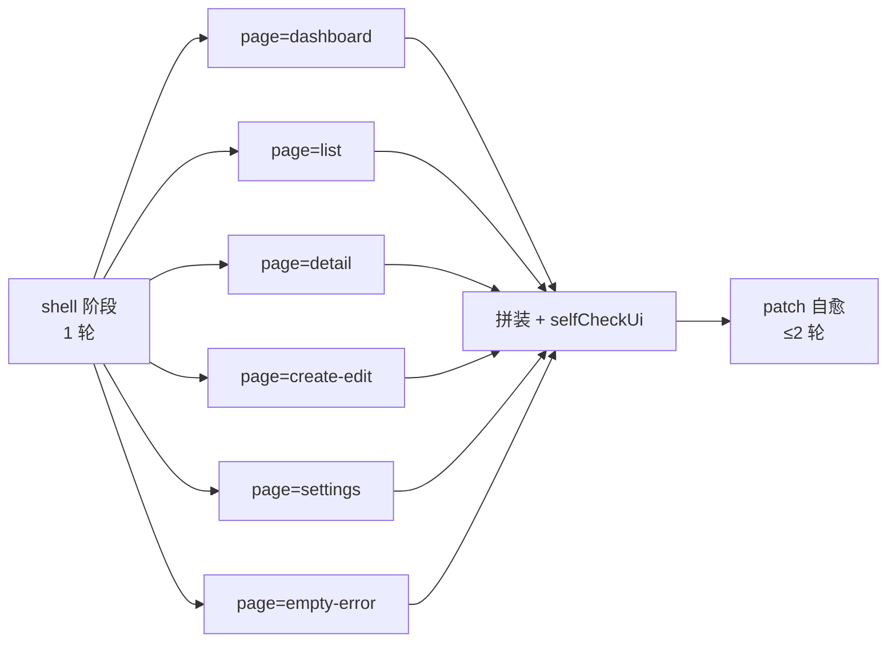

# UI 原型 Skill 库 v1.0（设计令牌 + 7 大模块 + 8 页面模板）

<aside>
🎯

**目的**：把 `src/lib/pi/ui-templates.ts` 的 8 套页面模板、设计令牌、7 大组件模块沉淀为可复用 Skill，由设计 Agent（subtype='ui'）通过 `ui_template_pack(page)` 工具按需取用，配合 [07 · 4 Agent 与提示词 v2.0](07%20%C2%B7%204%20Agent%20%E4%B8%8E%E6%8F%90%E7%A4%BA%E8%AF%8D%20v2%200%2040cc0580b8bd451d8aaf8cf66291e76a.md) §9.1 的 shell + 6 page + patch 三阶段流程使用。

**Skill 文件落地路径**：`docs/skills/ui-prototype.md` + `src/lib/pi/ui-templates.ts`。本页是这两份产物的**真源**。

</aside>

## 1. Skill 调用方式

设计 Agent UI 子产物的 prompt 链：



每个 page 阶段在 user message 中注入：

1. PRD 切片（≤ 8000 字符）
2. shell 摘要（≤ 4000 字符，复用设计令牌 + nav + mock data）
3. **本 Skill 库 §3 对应模板**（`ui_template_pack(page)` 返回值）
4. 本 Skill 库 §2 设计令牌（强制使用）
5. 本 Skill 库 §4 必含交互（按页面挑相关项）

## 2. 设计令牌（Design Tokens）

**统一 CSS 变量定义**，所有页面只用变量，不写裸 hex / px。

### 2.1 11 阶色板（Primary + Neutral + 4 语义色）

```css
:root {
	/* Primary（默认 indigo，可被 PRD 覆盖） */
	--c-primary-50:  #eef2ff;
	--c-primary-100: #e0e7ff;
	--c-primary-200: #c7d2fe;
	--c-primary-300: #a5b4fc;
	--c-primary-400: #818cf8;
	--c-primary-500: #6366f1;
	--c-primary-600: #4f46e5;
	--c-primary-700: #4338ca;
	--c-primary-800: #3730a3;
	--c-primary-900: #312e81;
	--c-primary-950: #1e1b4b;

	/* Neutral 11 阶 */
	--c-n-50:  #fafafa;  --c-n-100: #f5f5f5;  --c-n-200: #e5e5e5;
	--c-n-300: #d4d4d4;  --c-n-400: #a3a3a3;  --c-n-500: #737373;
	--c-n-600: #525252;  --c-n-700: #404040;  --c-n-800: #262626;
	--c-n-900: #171717;  --c-n-950: #0a0a0a;

	/* 4 语义色（success / warning / danger / info） */
	--c-success: #16a34a; --c-warning: #d97706;
	--c-danger:  #dc2626; --c-info:    #0284c7;
}
[data-theme="dark"] {
	--c-bg: var(--c-n-950); --c-fg: var(--c-n-50);
	--c-surface: var(--c-n-900); --c-border: var(--c-n-800);
}
[data-theme="light"] {
	--c-bg: #fff; --c-fg: var(--c-n-900);
	--c-surface: var(--c-n-50); --c-border: var(--c-n-200);
}
```

### 2.2 7 字号 + 8 间距 + 4 圆角 + 4 阴影 + 3 动效

```css
:root {
	/* 7 字号（rem） */
	--fs-xs: .75rem; --fs-sm: .875rem; --fs-base: 1rem; --fs-lg: 1.125rem;
	--fs-xl: 1.25rem; --fs-2xl: 1.5rem; --fs-3xl: 1.875rem;

	/* 8 间距（rem，对齐 4px 栅格） */
	--sp-1: .25rem; --sp-2: .5rem; --sp-3: .75rem; --sp-4: 1rem;
	--sp-6: 1.5rem; --sp-8: 2rem; --sp-12: 3rem; --sp-16: 4rem;

	/* 4 圆角 */
	--r-sm: 4px; --r-md: 8px; --r-lg: 12px; --r-full: 9999px;

	/* 4 阴影 */
	--sh-sm: 0 1px 2px rgb(0 0 0 / .05);
	--sh-md: 0 4px 6px -1px rgb(0 0 0 / .08), 0 2px 4px -2px rgb(0 0 0 / .06);
	--sh-lg: 0 10px 15px -3px rgb(0 0 0 / .10), 0 4px 6px -4px rgb(0 0 0 / .08);
	--sh-xl: 0 20px 25px -5px rgb(0 0 0 / .12), 0 8px 10px -6px rgb(0 0 0 / .08);

	/* 3 动效曲线 */
	--ease-out: cubic-bezier(.16,1,.3,1);
	--ease-in:  cubic-bezier(.7,0,.84,0);
	--ease-spring: cubic-bezier(.34,1.56,.64,1);
	--dur-fast: 120ms; --dur-base: 200ms; --dur-slow: 320ms;
}
```

## 3. 8 套页面模板（`UI_TEMPLATES`）

对应 `src/lib/pi/ui-templates.ts` 导出的 `UI_TEMPLATES` 字典；`ui_template_pack(page)` 工具返回这里的 HTML 片段（已包含 mock 占位与必备 ARIA）。

### 3.1 dashboard（数据仪表盘）

关键结构：4 张 KPI 卡（数值 + 趋势 + 迷你折线）+ 1 张主图（折线/柱状）+ 1 张 Top-N 列表 + 最近活动 timeline。

```html
<section id="page-dashboard" x-show="currentPage==='dashboard'" class="p-[var(--sp-6)] space-y-[var(--sp-6)]">
	<header class="flex items-center justify-between">
		<h1 class="text-[length:var(--fs-2xl)] font-semibold" x-text="t('dashboard.title')"></h1>
		<div class="flex gap-[var(--sp-2)]">
			<select class="h-9 px-3 rounded-[var(--r-md)] border" aria-label="时间范围" x-model="range">
				<template x-for="r in ['7d','30d','90d']"><option :value="r" x-text="r"></option></template>
			</select>
			<button class="btn-primary" @click="refresh()">刷新</button>
		</div>
	</header>
	<!-- KPI 4 张 -->
	<div class="grid grid-cols-1 md:grid-cols-2 xl:grid-cols-4 gap-[var(--sp-4)]">
		<template x-for="k in kpis" :key="k.id">
			<div class="card p-[var(--sp-4)]" role="region" :aria-label="k.label">
				<div class="text-[length:var(--fs-sm)] text-[color:var(--c-n-500)]" x-text="k.label"></div>
				<div class="text-[length:var(--fs-3xl)] font-bold" x-text="k.value"></div>
				<div class="text-[length:var(--fs-xs)]" :class="k.delta>=0?'text-[color:var(--c-success)]':'text-[color:var(--c-danger)]'" x-text="(k.delta>=0?'▲':'▼')+Math.abs(k.delta)+'%'"></div>
				<svg class="w-full h-10 mt-2" :data-spark="JSON.stringify(k.spark)"></svg>
			</div>
		</template>
	</div>
	<!-- 主图 + Top-N + Timeline 略，见完整模板 -->
</section>
```

### 3.2 list（列表/表格页）

关键结构：搜索框 + 多选筛选 + 列设置 + 主表（排序/选择/分页/批量操作）+ 空态/错态 + 骨架屏。

```html
<section id="page-list" x-show="currentPage==='list'" class="p-[var(--sp-6)]">
	<div class="flex flex-wrap gap-[var(--sp-3)] mb-[var(--sp-4)]">
		<input type="search" class="input flex-1 min-w-[240px]" placeholder="搜索..." x-model.debounce.300ms="q" aria-label="搜索">
		<select class="input" x-model="filterStatus" aria-label="状态筛选"><option value="">全部</option><option>active</option><option>archived</option></select>
		<button class="btn-secondary" @click="openColumnSettings=true" aria-haspopup="dialog">列设置</button>
		<button class="btn-primary" @click="openCreate=true">新建</button>
	</div>
	<div x-show="selected.length" class="sticky top-0 bg-[color:var(--c-primary-50)] border rounded-[var(--r-md)] px-3 py-2 mb-2 flex items-center gap-2" role="toolbar" aria-label="批量操作">
		<span x-text="`已选 ${selected.length} 项`"></span>
		<button class="btn-link" @click="bulkArchive()">批量归档</button>
		<button class="btn-link text-[color:var(--c-danger)]" @click="bulkDelete()">批量删除</button>
	</div>
	<table class="w-full text-sm" role="grid">
		<thead class="bg-[color:var(--c-surface)]">
			<tr>
				<th class="w-10"><input type="checkbox" @change="toggleAll($event)" :checked="allSelected" aria-label="全选"></th>
				<template x-for="c in cols" :key="c.key"><th class="text-left px-3 py-2 cursor-pointer" @click="sort(c.key)" :aria-sort="sortKey===c.key?(sortDir==='asc'?'ascending':'descending'):'none'" x-text="c.label"></th></template>
			</tr>
		</thead>
		<tbody>
			<template x-if="loading"><tr><td :colspan="cols.length+1"><div class="h-8 my-1 bg-[color:var(--c-n-100)] animate-pulse rounded"></div></td></tr></template>
			<template x-for="row in pageRows" :key="row.id">
				<tr class="hover:bg-[color:var(--c-n-50)]">
					<td><input type="checkbox" :value="row.id" x-model="selected"></td>
					<template x-for="c in cols"><td class="px-3 py-2" x-text="row[c.key]"></td></template>
				</tr>
			</template>
			<template x-if="!loading && pageRows.length===0"><tr><td :colspan="cols.length+1"><div class="empty-state">暂无数据，<button class="btn-link" @click="openCreate=true">立即创建</button></div></td></tr></template>
		</tbody>
	</table>
	<div class="pagination mt-4 flex justify-end gap-2"><!-- 分页器略 --></div>
</section>
```

### 3.3 detail（详情页）

左主信息 + 右侧栏（属性 + 时间线）+ 顶部操作栏（编辑/删除/分享）+ Tab 切换（详情/活动/评论）。

### 3.4 create-edit（创建/编辑表单）

zod-style 多分组表单 + 内联校验（onBlur + 提交时全量）+ 失败 Toast + 草稿保存（localStorage）+ 退出二次确认。

### 3.5 settings（设置页）

左侧二级 nav + 右侧分块表单（个人 / 通知 / 安全 / 集成 / 危险区）；危险区按钮红底，需输入项目名二次确认。

### 3.6 empty-error（空态/错态库）

6 个状态：`empty-first` / `empty-filter` / `empty-permission` / `error-network` / `error-500` / `error-404`，统一插画位 + 主操作 + 次操作。

### 3.7 auth-login（登录/注册）

邮箱 + 密码 + OAuth 三选一 + 验证码 + 忘记密码链接 + 服务条款勾选 + 注册引导。

### 3.8 command-palette（命令面板 cmd+k）

模态 + 搜索框 + 分组结果（最近 / 页面 / 命令 / 帮助）+ ↑↓ 键导航 + Enter 执行 + Esc 关闭。

## 4. 7 大组件模块（必含交互清单）

每个 page 必须按相关性勾选实现以下模块至少一个交互：

| 模块 | 核心组件 | 必含交互 | 无障碍 |
| --- | --- | --- | --- |
| **1. 导航 + Header** | 顶部主导航 / 侧栏二级 / 面包屑 | 当前态高亮 / hover 二级菜单 / 移动端汉堡 | aria-current="page" / nav role |
| **2. 表单 + 校验** | input / select / radio / checkbox / textarea / file | onBlur 校验 / 提交全量校验 / 错误内联红字 + aria-invalid | label 关联 / aria-describedby 错误 |
| **3. 数据表格** | 排序 / 筛选 / 分页 / 列设置 / 批量操作 | 表头点击排序 / 行选择 / 粘性表头 / 行悬停 | role=grid / aria-sort / aria-rowcount |
| **4. 模态 + 抽屉** | Dialog / Drawer / Confirm | 聚焦陷阱 / Esc 关闭 / 背景点击关闭可关 | role=dialog / aria-modal=true / 返焦触发元素 |
| **5. Toast + 反馈** | Toast / Banner / Skeleton / Spinner / Progress | 4 类（success/info/warning/danger）/ 自动关闭 / 操作链接 | role=status / aria-live=polite |
| **6. 命令面板 cmd+k** | 全局快捷搜索 | cmd+k / ↑↓ / Enter / Esc / fuzzy match | role=combobox / aria-activedescendant |
| **7. 主题 + i18n** | theme switcher / locale switcher | localStorage 记忆 / 跟随系统 / 中英文切换无刷新 | aria-label 切换器 |

## 5. 公共 class 库（与设计令牌绑定）

```html
<style>
.btn-primary { @apply h-9 px-4 rounded-[var(--r-md)] bg-[color:var(--c-primary-600)] text-white shadow-[var(--sh-sm)] hover:bg-[color:var(--c-primary-700)] focus:outline-none focus:ring-2 focus:ring-[color:var(--c-primary-300)] transition-colors duration-[var(--dur-fast)]; }
.btn-secondary { @apply h-9 px-4 rounded-[var(--r-md)] border border-[color:var(--c-border)] bg-[color:var(--c-surface)] hover:bg-[color:var(--c-n-100)]; }
.btn-link { @apply text-[color:var(--c-primary-600)] hover:underline; }
.input { @apply h-9 px-3 rounded-[var(--r-md)] border border-[color:var(--c-border)] bg-[color:var(--c-surface)] focus:outline-none focus:ring-2 focus:ring-[color:var(--c-primary-300)]; }
.card { @apply bg-[color:var(--c-surface)] border border-[color:var(--c-border)] rounded-[var(--r-lg)] shadow-[var(--sh-sm)]; }
.empty-state { @apply flex flex-col items-center justify-center py-12 gap-3 text-[color:var(--c-n-500)]; }
</style>
```

## 6. selfCheckUi 检查项（与本 Skill 库绑定）

`src/agents/design-agent.ts` 的 `selfCheckUi(html)` 必须检查的 10 项（满 100，阈值 70）：

- [ ]  6 个 `<!-- PAGE:xxx -->` 标记齐全（dashboard/list/detail/create-edit/settings/empty-error）（20 分）
- [ ]  `<!-- END:ui-shell -->` + 6 × `<!-- END:ui-${page} -->` 共 7 个结束标记齐全（10 分）
- [ ]  设计令牌 11 阶色板 + 7 字号 + 8 间距 + 4 圆角 + 4 阴影变量都定义（10 分）
- [ ]  全局 `data-theme` 切换 + `[data-theme="dark"]` 覆盖（5 分）
- [ ]  i18n `t()` 函数 + 至少 2 种 locale（5 分）
- [ ]  命令面板（cmd+k）骨架（5 分）
- [ ]  ≥ 12 类不同交互（按钮/链接/表单/排序/筛选/分页/Tab/模态/抽屉/Toast/骨架/拖拽 等）（15 分）
- [ ]  ≥ 80 个 DOM 节点 / 页（10 分）
- [ ]  aria-* 属性覆盖率 ≥ 50% 交互元素（10 分）
- [ ]  无 Lorem ipsum / TODO / 占位英文文案（10 分）

## 7. 引用关系

- Skill 文件：`docs/skills/ui-prototype.md`
- 模板源码：`src/lib/pi/ui-templates.ts` 导出 `UI_TEMPLATES` 字典
- 工具：`ui_template_pack(page)` 在设计阶段对 design-agent 开放
- 流程：[07 · 4 Agent 与提示词 v2.0](07%20%C2%B7%204%20Agent%20%E4%B8%8E%E6%8F%90%E7%A4%BA%E8%AF%8D%20v2%200%2040cc0580b8bd451d8aaf8cf66291e76a.md) §9.1
- Patch 自愈：[全栈智码 v2.0 · Fix-Pack #4（设计 UI + 开发阶段 + 沙箱替代 for Claude Code）](%E5%85%A8%E6%A0%88%E6%99%BA%E7%A0%81%20v2%200%20%C2%B7%20Fix-Pack%20#4%EF%BC%88%E8%AE%BE%E8%AE%A1%20UI%20+%20%E5%BC%80%E5%8F%91%E9%98%B6%E6%AE%B5%20+%20%E6%B2%99%E7%AE%B1%E6%9B%BF%E4%BB%A3%20for%20Cl%203e7bd8639ec44063aec90d24fa4c1930.md) J0.2