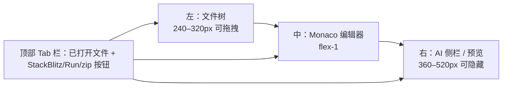

# 代码浏览器 + StackBlitz 嵌入 · 前端组件原型 v1.0

<aside>
🎯

**目的**：开发阶段「查阅 + 修改」的默认入口。沙箱降级为可选 Run（详见 [09 · 沙箱与 Run v2.0](09%20%C2%B7%20%E6%B2%99%E7%AE%B1%E4%B8%8E%20Run%20v2%200%2097de60ce18334da7be5c9ac6a500c50d.md) §11），日常路径走「文件树 + Monaco + AI patch + StackBlitz 嵌入 + zip 下载」四件套。

**目标平台**：Next.js 14 App Router + React 18 + Tailwind + shadcn/ui + zustand。组件挂载位置：`src/app/projects/[id]/dev/page.tsx` 三栏右半部分。

</aside>

## 1. 三栏布局总览



顶部一个工具条，下面三栏。文件树支持折叠（Cmd+B），AI 侧栏支持折叠（Cmd+J）。

## 2. 文件树 API 形状

### 2.1 后端 `GET /api/projects/:id/dev/tree` 响应

```tsx
export interface FileTreeNode {
	path: string                 // workspace 相对路径，posix 正斜杠
	name: string                 // 文件/目录名
	type: 'file' | 'dir'
	size?: number                // bytes，仅 file
	mtime?: number               // epoch ms
	lang?: SupportedLang         // 仅 file，扩展名→语言映射
	children?: FileTreeNode[]    // 仅 dir，递归；空目录为 []
}

export interface FileTreeResp {
	projectId: string
	workspaceDir: string         // 服务器侧绝对路径，仅做调试展示
	root: FileTreeNode           // type='dir', path=''
	totalFiles: number
	totalSize: number
	truncated: boolean           // 超过 5000 文件 / 50MB 时截断
	skipped: string[]            // 被忽略的目录名
}
```

忽略规则（与沙箱 zip 同步）：`node_modules` / `.git` / `.next` / `dist` / `.turbo` / `.cache` / `coverage` / `*.log`。

### 2.2 前端 zustand store 形状

```tsx
interface CodeBrowserState {
	tree: FileTreeNode | null
	expanded: Set<string>          // 已展开目录 path
	selected: string | null        // 当前激活文件 path
	opened: string[]               // Tab 栏已打开顺序
	dirty: Record<string, boolean> // path → 是否未保存
	content: Record<string, string>// path → 文件内容缓存
	origContent: Record<string, string> // path → 原始内容（用于 diff / 撤销）

	loadTree(): Promise<void>
	openFile(path: string): Promise<void>
	closeTab(path: string): void
	save(path: string): Promise<void>
	saveAll(): Promise<void>
	revert(path: string): void
}
```

持久化：`opened` + `selected` + `expanded` 写 `sessionStorage`，刷新后恢复。`content` 不持久化。

### 2.3 文件树组件骨架

```tsx
export function FileTree() {
	const { tree, expanded, selected, openFile, toggleDir } = useCodeBrowser()
	if (!tree) return <Skeleton className="h-full" />
	return (
		<div role="tree" aria-label="项目文件" className="h-full overflow-auto select-none text-sm font-mono">
			<TreeNode node={tree} depth={0} />
		</div>
	)
}
function TreeNode({ node, depth }: { node: FileTreeNode, depth: number }) {
	const { expanded, selected, openFile, toggleDir } = useCodeBrowser()
	const isOpen = expanded.has(node.path)
	if (node.type === 'dir') return (
		<div role="treeitem" aria-expanded={isOpen}>
			<button className="flex items-center gap-1 w-full px-2 py-0.5 hover:bg-muted"
				style= paddingLeft: depth * 12 + 8  onClick={() => toggleDir(node.path)}>
				<ChevronRight className={cn('size-3 transition-transform', isOpen && 'rotate-90')} />
				<Folder className="size-4" /> {node.name}
			</button>
			{isOpen && node.children?.map(c => <TreeNode key={c.path} node={c} depth={depth+1} />)}
		</div>
	)
	return (
		<button role="treeitem" aria-selected={selected===node.path}
			className={cn('flex items-center gap-2 w-full px-2 py-0.5 hover:bg-muted', selected===node.path && 'bg-accent')}
			style= paddingLeft: depth * 12 + 22  onClick={() => openFile(node.path)}>
			<FileIcon lang={node.lang} className="size-4" /> {node.name}
			{useCodeBrowser().dirty[node.path] && <span className="size-1.5 rounded-full bg-orange-500" aria-label="未保存" />}
		</button>
	)
}
```

## 3. Monaco 配置

### 3.1 安装 + 懒加载

```tsx
// package.json: "@monaco-editor/react": "^4.6.0", "monaco-editor": "^0.50.0"
import dynamic from 'next/dynamic'
const MonacoEditor = dynamic(() => import('@monaco-editor/react').then(m => m.default), { ssr: false })
```

### 3.2 语言映射

```tsx
export type SupportedLang = 'typescript'|'javascript'|'tsx'|'jsx'|'json'|'css'|'scss'|'html'|'markdown'|'yaml'|'shell'|'sql'|'plaintext'
export const EXT_TO_LANG: Record<string, SupportedLang> = {
	ts: 'typescript', tsx: 'typescript', mts: 'typescript', cts: 'typescript',
	js: 'javascript', jsx: 'javascript', mjs: 'javascript', cjs: 'javascript',
	json: 'json', jsonc: 'json',
	css: 'css', scss: 'scss', sass: 'scss',
	html: 'html', htm: 'html',
	md: 'markdown', mdx: 'markdown',
	yml: 'yaml', yaml: 'yaml',
	sh: 'shell', bash: 'shell', zsh: 'shell',
	sql: 'sql',
}
export function detectLang(path: string): SupportedLang {
	const ext = path.split('.').pop()?.toLowerCase() ?? ''
	return EXT_TO_LANG[ext] ?? 'plaintext'
}
```

### 3.3 默认 options（深浅主题 + 字号 + tab）

```tsx
export const MONACO_OPTIONS: import('monaco-editor').editor.IStandaloneEditorConstructionOptions = {
	fontSize: 13,
	fontFamily: '"JetBrains Mono", "Fira Code", ui-monospace, monospace',
	fontLigatures: true,
	tabSize: 2,
	insertSpaces: true,
	detectIndentation: true,
	wordWrap: 'on',
	minimap: { enabled: false },
	lineNumbers: 'on',
	scrollBeyondLastLine: false,
	renderWhitespace: 'selection',
	bracketPairColorization: { enabled: true },
	guides: { bracketPairs: 'active', indentation: true },
	suggestOnTriggerCharacters: true,
	quickSuggestions: { other: true, comments: false, strings: true },
	inlineSuggest: { enabled: true },
	formatOnPaste: true,
	formatOnType: false,
	cursorBlinking: 'smooth',
	cursorSmoothCaretAnimation: 'on',
	smoothScrolling: true,
	automaticLayout: true,
}
```

主题：`vs-dark` / `light` 跟随 `useTheme()`；自定义品牌色覆盖：

```tsx
import { loader } from '@monaco-editor/react'
loader.init().then(monaco => {
	monaco.editor.defineTheme('zhima-dark', {
		base: 'vs-dark', inherit: true, rules: [],
		colors: { 'editor.background': '#0a0a0a', 'editor.lineHighlightBackground': '#1a1a1a' },
	})
	monaco.editor.defineTheme('zhima-light', {
		base: 'vs', inherit: true, rules: [],
		colors: { 'editor.background': '#ffffff' },
	})
})
```

### 3.4 onMount 注册键位 + 模型管理

```tsx
<MonacoEditor
	height="100%"
	theme={isDark ? 'zhima-dark' : 'zhima-light'}
	path={selected ?? ''}                       // ← path 切换自动复用 model，保留 undo 栈
	language={detectLang(selected ?? '')}
	value={selected ? content[selected] : ''}
	options={MONACO_OPTIONS}
	onChange={(v) => selected && setBuffer(selected, v ?? '')}
	onMount={(editor, monaco) => {
		editorRef.current = editor
		registerKeybindings(editor, monaco)
		registerAiPatchAction(editor, monaco)
	}}
/>
```

## 4. 关键键位（全局 + 编辑器内）

| 键位 | 作用 | 作用域 | 实现 |
| --- | --- | --- | --- |
| **Cmd/Ctrl + S** | 保存当前文件 | 编辑器 | `addCommand(KeyMod.CtrlCmd \| KeyCode.KeyS, save)` |
| **Cmd/Ctrl + Shift + S** | 全部保存 | 编辑器 | `addCommand(KeyMod.CtrlCmd \| KeyMod.Shift \| KeyCode.KeyS, saveAll)` |
| **Cmd/Ctrl + P** | 快速打开（fuzzy 文件名） | 全局 | 命令面板，复用 §3.7 cmd+k 组件 |
| **Cmd/Ctrl + Shift + F** | 全工程搜索 | 全局 | 调 `/api/projects/:id/dev/search?q=` 后端 ripgrep |
| **Cmd/Ctrl + B** | 切换文件树 | 全局 | `useLayout().toggleSidebar()` |
| **Cmd/Ctrl + J** | 切换 AI 侧栏 | 全局 | `useLayout().toggleAiPanel()` |
| **Cmd/Ctrl + K** | 命令面板 | 全局 | 已有组件，扩展「让 AI 改这段」「在 StackBlitz 中预览」「下载 zip」 |
| **Cmd/Ctrl + .**  | 对当前选区调起 AI patch | 编辑器 | `registerAiPatchAction`，弹气泡输入框 |
| **Cmd/Ctrl + W** | 关闭当前 Tab | 编辑器 | dirty 时弹确认 |
| **Cmd/Ctrl + Z / Shift+Z** | 撤销 / 重做 | 编辑器 | Monaco 内置 |
| **Esc** | 关闭气泡 / Modal | 全局 | — |
| **Alt + ↑ / ↓** | 移动行 | 编辑器 | Monaco 内置 |
| **Cmd/Ctrl + D** | 选中下一同名 token | 编辑器 | Monaco 内置 |

键位注册示例：

```tsx
function registerKeybindings(editor: monaco.editor.IStandaloneCodeEditor, m: typeof monaco) {
	editor.addCommand(m.KeyMod.CtrlCmd | m.KeyCode.KeyS, () => useCodeBrowser.getState().save(useCodeBrowser.getState().selected!))
	editor.addCommand(m.KeyMod.CtrlCmd | m.KeyMod.Shift | m.KeyCode.KeyS, () => useCodeBrowser.getState().saveAll())
	editor.addCommand(m.KeyMod.CtrlCmd | m.KeyCode.KeyW, () => closeCurrentTab())
}

function registerAiPatchAction(editor: monaco.editor.IStandaloneCodeEditor, m: typeof monaco) {
	editor.addAction({
		id: 'zhima.ai-patch',
		label: '让 AI 改这段',
		keybindings: [m.KeyMod.CtrlCmd | m.KeyCode.Period],
		contextMenuGroupId: 'navigation',
		run: (ed) => {
			const sel = ed.getSelection(); if (!sel) return
			const path = useCodeBrowser.getState().selected!
			openAiPatchPopover({ path, range: [sel.startLineNumber, sel.endLineNumber] })
		},
	})
}
```

## 5. AI patch 气泡形状

```tsx
export interface AiPatchRequest {
	projectId: string
	filePath: string
	range: [number, number]      // 起止行号（1-based，含两端）
	instruction: string          // 用户自然语言指令
	selectedText?: string        // 选区原文（可选，便于 LLM 校验）
}
export interface AiPatchResponse {
	ok: boolean
	diff?: string                // unified diff，前端渲染 inline diff
	newContent?: string          // 整文件新内容（可直接 setValue）
	reason?: string
}
```

后端：`POST /api/projects/:id/dev/patch` 走 dev-agent 的 `DEV_PATCH_SYSTEM` override（详见 [全栈智码 v2.0 · Fix-Pack #4（设计 UI + 开发阶段 + 沙箱替代 for Claude Code）](%E5%85%A8%E6%A0%88%E6%99%BA%E7%A0%81%20v2%200%20%C2%B7%20Fix-Pack%20#4%EF%BC%88%E8%AE%BE%E8%AE%A1%20UI%20+%20%E5%BC%80%E5%8F%91%E9%98%B6%E6%AE%B5%20+%20%E6%B2%99%E7%AE%B1%E6%9B%BF%E4%BB%A3%20for%20Cl%203e7bd8639ec44063aec90d24fa4c1930.md) J3.3）。

气泡 UX：选区底部弹出，输入框 `placeholder="用一句话说明要改什么…"`，Enter 提交，Cmd+Enter 直接接受补丁，Esc 取消。

## 6. StackBlitz 嵌入

### 6.1 SDK 接入

```tsx
import sdk from '@stackblitz/sdk'

export async function openInStackBlitz(projectId: string) {
	const tree = await fetch(`/api/projects/${projectId}/dev/tree`).then(r => r.json()) as FileTreeResp
	const files: Record<string, string> = {}
	for (const node of flattenFiles(tree.root)) {
		if (node.size && node.size > 256 * 1024) continue   // 跳过 >256KB 大文件
		const content = await fetch(`/api/projects/${projectId}/dev/file?path=${encodeURIComponent(node.path)}`).then(r => r.text())
		files[node.path] = content
	}
	sdk.openProject({
		title: `zhima/${projectId.slice(0,8)}`,
		description: '由全栈智码自动生成',
		template: 'node',
		files,
	}, { newWindow: true, openFile: 'src/app/page.tsx' })
}

export async function embedStackBlitz(projectId: string, container: HTMLElement) {
	const tree = await fetch(`/api/projects/${projectId}/dev/tree`).then(r => r.json())
	const files = await collectFiles(projectId, tree.root)
	return sdk.embedProject(container, {
		title: 'preview', template: 'node', files,
	}, { height: '100%', clickToLoad: false, view: 'preview', hideExplorer: true, hideNavigation: false })
}
```

### 6.2 离线 / 不可达兜底

按钮初始 disabled，挂载后并行 ping `https://stackblitz.com/_/health`（10s 超时），失败则隐藏按钮 + 灰显，提示文案「StackBlitz 不可达，可改用『下载 zip』」。

```tsx
export function useStackBlitzAvailable(): boolean | null {
	const [ok, setOk] = useState<boolean | null>(null)
	useEffect(() => {
		const c = new AbortController(); const t = setTimeout(() => c.abort(), 10_000)
		fetch('https://stackblitz.com/_/health', { signal: c.signal, mode: 'no-cors' })
			.then(() => setOk(true)).catch(() => setOk(false)).finally(() => clearTimeout(t))
	}, [])
	return ok
}
```

## 7. Tab 栏 + 工具条组件

```tsx
export function DevWorkbenchTopbar() {
	const { selected, dirty, save, saveAll } = useCodeBrowser()
	const sbAvailable = useStackBlitzAvailable()
	return (
		<div className="flex items-center justify-between border-b px-3 h-10">
			<TabBar />
			<div className="flex items-center gap-1">
				<Button size="sm" variant="ghost" onClick={() => save(selected!)} disabled={!selected || !dirty[selected!]}>💾 保存 <kbd>⌘S</kbd></Button>
				<Button size="sm" variant="ghost" onClick={saveAll} disabled={Object.values(dirty).every(v=>!v)}>全部保存</Button>
				<Separator orientation="vertical" className="h-6" />
				<Button size="sm" variant="ghost" onClick={() => openAiPatchPopover()} disabled={!selected}>🤖 让 AI 改这段 <kbd>⌘.</kbd></Button>
				<Button size="sm" variant="ghost" onClick={() => openInStackBlitz(projectId)} disabled={!sbAvailable}>⚡ StackBlitz</Button>
				<Button size="sm" variant="ghost" onClick={() => location.href=`/api/projects/${projectId}/dev/zip`}>⬇️ 下载 zip</Button>
				<Button size="sm" variant="ghost" onClick={() => runSandbox()}>▶ 运行（沙箱）</Button>
			</div>
		</div>
	)
}
```

## 8. 无障碍 + 性能要点

- 文件树用 `role="tree"` / `treeitem` / `aria-expanded` / `aria-selected`，支持键盘 ↑↓ ← →（← 折叠 / → 展开 / Enter 打开）
- Monaco 自带 a11y，但需在容器上设置 `aria-label="代码编辑器：${selected}"`
- 文件树 ≥ 5000 节点时启用虚拟滚动（`react-window`）；当前不启用
- 文件内容 > 1 MB 改用只读 + 提示「文件过大，建议下载」
- 文件保存做乐观更新：先本地 `dirty=false`，PUT 失败回滚 + Toast

## 9. 验收

```bash
# 1. 文件树加载
curl http://localhost:3000/api/projects/$ID/dev/tree | jq '.root.children | length'
# 2. 打开 + 编辑 + 保存
# 浏览器：⌘P 快速打开 src/app/page.tsx → 改一行 → ⌘S → 检查 200 + 文件变化
# 3. AI patch
# 选中函数 → ⌘. → 输入「加上错误处理」→ 接受补丁 → diff 预览正确
# 4. StackBlitz 嵌入
# 点击 ⚡ StackBlitz → 新窗口 90s 内显示页面
# 5. zip 下载
curl -OJ http://localhost:3000/api/projects/$ID/dev/zip
unzip -l *.zip | tail -5   # 含 src/app/page.tsx 等
```

## 10. 关联文档

- 后端 API：[09 · 沙箱与 Run v2.0](09%20%C2%B7%20%E6%B2%99%E7%AE%B1%E4%B8%8E%20Run%20v2%200%2097de60ce18334da7be5c9ac6a500c50d.md) §11.4
- 沙箱 Run（可选）：[09 · 沙箱与 Run v2.0](09%20%C2%B7%20%E6%B2%99%E7%AE%B1%E4%B8%8E%20Run%20v2%200%2097de60ce18334da7be5c9ac6a500c50d.md) §11.2
- AI patch override：[全栈智码 v2.0 · Fix-Pack #4（设计 UI + 开发阶段 + 沙箱替代 for Claude Code）](%E5%85%A8%E6%A0%88%E6%99%BA%E7%A0%81%20v2%200%20%C2%B7%20Fix-Pack%20#4%EF%BC%88%E8%AE%BE%E8%AE%A1%20UI%20+%20%E5%BC%80%E5%8F%91%E9%98%B6%E6%AE%B5%20+%20%E6%B2%99%E7%AE%B1%E6%9B%BF%E4%BB%A3%20for%20Cl%203e7bd8639ec44063aec90d24fa4c1930.md) J3.3
- 整体三栏布局：[02 · 信息架构与三栏布局规格 v3.0](https://www.notion.so/02-v3-0-c8119b8868764ed68d11e69fde7669d1?pvs=21)