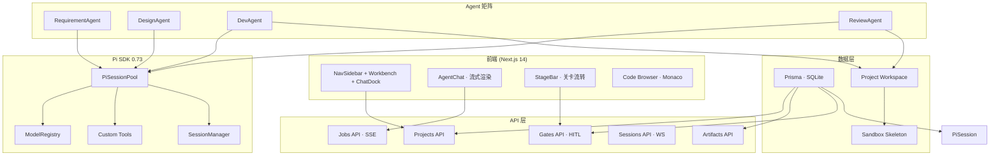

# 全栈智码 v2.0 架构总览

## 核心数据流

1. **用户输入一句话需求** → RequirementAgent 生成 PRD → G1 锁定 → 进入设计
2. **设计阶段** → DesignAgent 生成 5 个子产物 → G2 锁定 → 进入开发
3. **开发阶段** → DevAgent 基于 Pi SessionPool 在 workspace 生成代码 → 沙箱启动验证 → G3 锁定
4. **审查阶段** → ReviewAgent 跑 eslint/tsc → 生成缺陷报告 → fixReview 闭环修复 → G4 锁定
5. **导出阶段** → Export 生成 zip/docx → G5/G6 锁定 → 完成交付

## 技术栈

- **框架**: Next.js 14 (App Router) + React 18
- **语言**: TypeScript 5
- **数据库**: SQLite (Prisma ORM 5.18)
- **AI**: Pi SDK 0.73 + DeepSeek API
- **沙箱**: Node.js child_process (Windows: shell mode)
- **前端**: Tailwind CSS + Alpine.js + shadcn/ui
